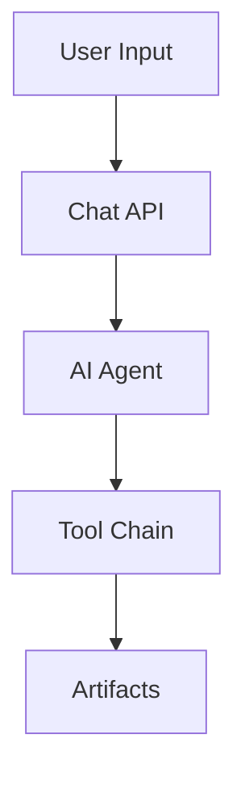

# Super Turbo Monorepo — Universal AGENTS.md

Scope: Canonical guidance for AI assistants and human contributors across the monorepo. Language: English only.

Quick entry points

- apps/super-chatbot/README.md
- apps/super-chatbot/docs/README.md

Contents

- 1. Overview
- 2. Monorepo map
- 3. Technology stack
- 4. Core principles
- 5. Architecture patterns
- 6. Development workflow
- 7. Coding standards
- 8. Documentation structure
- 9. PR checklist
- 10. Optional: MCP GitHub workflow
- 11. Quick links

## 1. Overview

Super Turbo unifies a production AI media creation app (super-chatbot) and a marketing/documentation site (super-landing). The system provides AI-powered text, image, and video generation with real-time progress tracking and curated documentation.

## 2. Monorepo map

apps/
├─ super-chatbot/ Next.js 15 App Router, TypeScript, AI tools
└─ super-landing/ Marketing + documentation site
docs/ Shared docs and references

## 3. Technology stack

Global

- Monorepo: pnpm, turborepo (if present), shared TypeScript configs
- Language: TypeScript, modern ECMAScript
- Styling: Tailwind CSS (landing), shadcn/ui / Radix primitives (chatbot UI)
- State: React hooks and server actions, no global client state unless needed
- Testing: Playwright/Cypress (e2e), Jest/Vitest (unit)
- CI/CD: GitHub Actions (typical), Cloudflare/Vercel deployment for apps
- Observability: Sentry (server/client), structured logs

App: super-chatbot

- Framework: Next.js 15 App Router with server actions
- AI: Internal proxy routes to external providers (SuperDuperAI, etc.)
- Real-time: SSE and WebSocket where applicable
- Data: File-centric artifacts (text, image, video, sheet); DB for users, balances, history
- Security: Server-only secrets, typed API boundaries, rate limiting

App: super-landing

- Framework: Next.js 15 (multi-locale marketing site)
- Content: Markdown-driven (public/markdown/\*\*)
- Deployment: Cloudflare Pages/Workers recommended
- SEO: Pre-rendered pages, sitemaps, structured data

## 4. Core principles

AI-First development methodology

- Phase 1 Planning: Write an implementation plan, validate against architecture, get approval
- Phase 2 Implementation: Code to plan, write tests, update docs, reference plan in PR

AICODE comment system

- AICODE-NOTE: Persist critical knowledge (complex logic, integrations, performance, security)
- AICODE-TODO: Actionable follow-ups scoped to code location
- AICODE-ASK: Questions needing human decisions; convert to NOTE once resolved

Context preservation

- Before edits: grep for AICODE in target files
- Convert ASK → NOTE when resolved
- Keep notes concise, colocated with the code

Security posture

- Never expose secrets client-side; all tokens live server-side
- Enforce auth and rate limiting on internal APIs
- Validate inputs and normalize external error shapes

## 5. Architecture patterns

Typed Proxy Architecture

- Frontend never calls external OpenAPI endpoints directly
- All external requests go through internal Next.js API routes with type enforcement, auth, and error handling
- Server-only configuration for external tokens

Internal API routes

- Located under app/api/\*\*
- Validate requests, return standardized error shapes
- Stream responses where appropriate (AI operations)

Real-time events

- Prefer direct SSE channels for low-latency progress
- Use file-based channels where feasible
- Add proxying only when necessary

Typed clients and hooks

- Encapsulate internal proxy access, model discovery, and caching
- Live under src/lib/api/client and src/hooks

## 6. Development workflow

- Read this AGENTS.md
- Review app-level AGENTS.md for super-chatbot or super-landing as needed
- Phase 1: author implementation plan (store under apps/super-chatbot/docs/development/implementation-plans/)
- Get approval
- Phase 2: implement, write tests, update docs
- Add/maintain AICODE comments
- Open PR referencing the plan; ensure CI passes

## 7. Coding standards

TypeScript

- Strict typing; no any unless justified with AICODE-NOTE
- Prefer explicit return types for public functions
- Reuse shared types under src/lib/types

React/Next.js

- Server-first; move logic to server actions/API routes
- Use Suspense/Stream where valuable
- Avoid client-side secrets or direct external calls

API and errors

- Validate with zod/valibot (or project standard)
- Return typed success/error envelopes consistently
- Log with context, avoid leaking secrets

Environment and config

- Keep .env.\* server-only; document required variables
- Centralize configuration under src/lib/config

Tests

- Unit tests for pure logic; integration tests for routes and hooks
- e2e flows for critical user journeys

Performance

- Cache stable responses; paginate heavy queries
- Stream long-running operations for responsiveness

## 8. Documentation structure (content tree)

apps/super-chatbot/docs/
├─ development/
│ ├─ ai-development-methodology.md
│ ├─ README.md
│ └─ implementation-plans/
├─ architecture/
│ └─ README.md
├─ api-integration/
│ └─ README.md
├─ ai-capabilities/
├─ maintenance/
├─ websockets-implementation/
└─ reference/

apps/super-landing/docs/
├─ architecture/
├─ seo/
├─ tasks/
└─ troubleshooting/

## 9. PR checklist

- Reference approved implementation plan in PR description
- Update documentation relevant to the change
- Include/adjust tests; all checks must pass
- Verify real-time behaviors (SSE/WebSockets) where applicable
- Review AICODE comments: close TODOs, convert ASK to NOTE
- Security review: secrets, auth, rate limiting, error shapes

## 10. Optional: MCP GitHub workflow

- Labels: triage, in-progress, blocked, needs-info, docs, ai-tools, backend, frontend, done
- Triage loop:
  1. New issue → label and request missing details
  2. Assign owner → move to in-progress
  3. If blocked → specify blocker and next check-in time
  4. Close when tests pass and docs updated with plan reference

## 11. Quick links

- apps/super-chatbot/AGENTS.md
- apps/super-chatbot/docs/development/ai-development-methodology.md
- apps/super-chatbot/docs/architecture/README.md
- apps/super-chatbot/docs/api-integration/README.md
- docs/reference/external/

## Diagram

