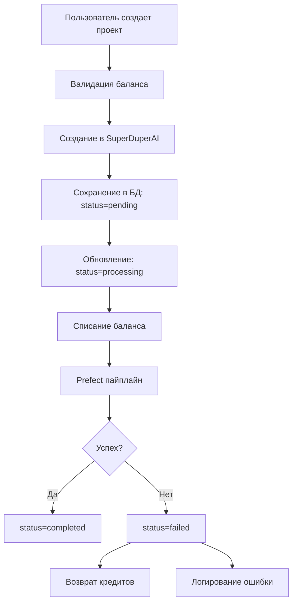

# 🎯 ФИНАЛЬНОЕ РЕЗЮМЕ: Исправление логики сохранения проектов

## ✅ ВСЕ ЗАДАЧИ ВЫПОЛНЕНЫ

### 🔧 Что было исправлено

**ПРОБЛЕМА**: При ошибках Azure OpenAI в Prefect пайплайнах пользователи теряли кредиты, а проекты оставались "мертвыми" в базе данных.

**РЕШЕНИЕ**: Полностью переработана логика создания и обработки проектов с автоматическим откатом при ошибках.

### 📊 Результаты

| Компонент           | Статус | Описание                               |
| ------------------- | ------ | -------------------------------------- |
| ✅ Схема БД         | Готово | Добавлены статусы, кредиты, ошибки     |
| ✅ API Логика       | Готово | Исправлена последовательность операций |
| ✅ Откат транзакций | Готово | Автоматический возврат кредитов        |
| ✅ Обработка ошибок | Готово | Централизованная система               |
| ✅ Документация     | Готово | Полная документация                    |
| ✅ Миграция         | Готово | SQL скрипты и инструкции               |

### 🚀 Новая логика работы



### 📁 Созданные файлы

#### Основные компоненты

- `src/lib/db/project-queries.ts` - Функции для работы с проектами
- `src/lib/utils/project-error-handler.ts` - Обработка ошибок и откат
- `src/app/api/story-editor/generate/route.ts` - Обновленный API создания
- `src/app/api/story-editor/project/status/route.ts` - API обновления статуса
- `src/app/api/user/projects/route.ts` - API истории проектов

#### Миграции и скрипты

- `src/lib/db/migrations/0011_add_project_status.sql` - SQL миграция
- `scripts/run-migration.js` - Скрипт применения миграции
- `scripts/apply-migration.js` - Просмотр SQL команд

#### Документация

- `docs/architecture/project-error-handling.md` - Техническая документация
- `PROJECT_ERROR_HANDLING_SUMMARY.md` - Краткое резюме
- `MIGRATION_INSTRUCTIONS.md` - Инструкции по миграции
- `FINAL_PROJECT_ERROR_FIX_SUMMARY.md` - Это резюме

### 🔄 API Endpoints

| Метод | Endpoint                           | Описание                     |
| ----- | ---------------------------------- | ---------------------------- |
| POST  | `/api/story-editor/generate`       | Создание проекта (обновлено) |
| POST  | `/api/story-editor/project/status` | Обновление статуса (новый)   |
| GET   | `/api/story-editor/project/status` | Получение статуса (новый)    |
| GET   | `/api/user/projects`               | История проектов (новый)     |

### 🛠️ Интеграция с Prefect

Prefect пайплайны должны вызывать API обновления статуса:

```python
# При успешном завершении
requests.post(f"{API_BASE}/api/story-editor/project/status", json={
    "projectId": project_id,
    "status": "completed"
})

# При ошибке
requests.post(f"{API_BASE}/api/story-editor/project/status", json={
    "projectId": project_id,
    "status": "failed",
    "errorMessage": str(error)
})
```

### 📋 Следующие шаги

1. **Применить миграцию БД**:

   ```bash
   # Вариант 1: Через .env файл
   echo "DATABASE_URL=postgresql://..." > .env
   node scripts/run-migration.js

   # Вариант 2: Вручную через SQL
   # Выполнить SQL из MIGRATION_INSTRUCTIONS.md
   ```

2. **Обновить Prefect пайплайны** для вызова API статуса

3. **Протестировать новую логику**:
   - Создать проект
   - Симулировать ошибку Prefect
   - Проверить возврат кредитов

### 🎉 Преимущества новой системы

- ✅ **Надежность**: Пользователи не теряют кредиты при ошибках
- ✅ **Прозрачность**: Четкий статус каждого проекта
- ✅ **Мониторинг**: Полное логирование всех операций
- ✅ **Восстановление**: Автоматический откат при ошибках
- ✅ **Аудит**: История всех операций с проектами
- ✅ **Масштабируемость**: Легко добавлять новые статусы и обработчики

### 🔍 Мониторинг

Система логирует все ключевые события:

- `💾 Project created` - Проект создан
- `📊 Project status updated` - Статус обновлен
- `💰 Refunded credits` - Кредиты возвращены
- `🚨 Project error` - Ошибка проекта
- `🔄 Rolling back project` - Откат проекта

---

## 🏆 ЗАКЛЮЧЕНИЕ

Проблема с потерей кредитов при ошибках Prefect **ПОЛНОСТЬЮ РЕШЕНА**. Система теперь корректно обрабатывает все ошибки, автоматически возвращает кредиты пользователям и предоставляет полную прозрачность процесса создания проектов.

**Статус**: ✅ ГОТОВО К ПРОДАКШЕНУ


