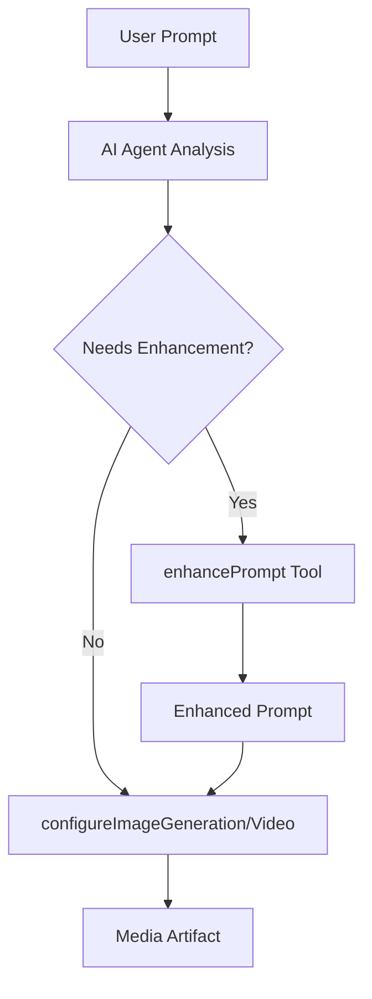

# Prompt Enhancement Capabilities

Advanced AI-powered prompt enhancement system for improving user prompts before media generation.

## Overview

The prompt enhancement system transforms simple, unclear, or non-English prompts into detailed, professional descriptions optimized for AI generation models. It provides both standalone tools and automatic AI agent integration.

## Features

### Automatic Enhancement
- **Language Detection & Translation**: Automatically detects and translates Russian text to English
- **Quality Improvement**: Adds professional terminology and quality descriptors  
- **Media Optimization**: Tailors enhancements for image, video, or text generation
- **Intelligent Analysis**: Determines when enhancement is needed vs when to use original

### Standalone Tools
- **Prompt Enhancer Tool**: `/tools/prompt-enhancer` - Dedicated interface for prompt improvement
- **API Integration**: Server-side enhancement via `/api/enhance-prompt` endpoint
- **Real-time Processing**: Live enhancement with copy-to-clipboard functionality

### AI Agent Integration
- **Automatic Workflow**: AI agent decides when to enhance prompts before generation
- **Tool Orchestration**: Uses AI SDK tool chaining for intelligent enhancement
- **Transparent Process**: Shows users both original and enhanced prompts

## Components

### [Automatic AI Integration](./automatic-ai-integration.md)
**Primary Feature** - AI agent automatically enhances simple prompts before image/video generation
- **Architecture**: Agent-based tool orchestration using AI SDK
- **Workflow**: Intelligent prompt analysis → enhancement → generation
- **Benefits**: Seamless UX, better generation quality, user transparency

### [Prompt Enhancement Tool](../../ai-tools/prompt-enhancement-tool.md)  
**Standalone Application** - Dedicated tool for manual prompt improvement
- **Location**: `/tools/prompt-enhancer`
- **Features**: Form-based interface, real-time enhancement, copy functionality
- **Use Cases**: Manual prompt crafting, learning prompt engineering

## Enhancement Criteria

### Simple Prompts (Auto-Enhanced)
```
✅ Russian text: "мальчик с мячиком"
✅ Short English: "cat on table", "fast car"  
✅ Basic descriptions: Under 50 characters or 5 words
✅ Missing quality terms: No "professional", "detailed", etc.
```

### Complex Prompts (Unchanged)
```
❌ Already detailed: "Professional photography of elegant cat..."
❌ Technical language: Contains artistic/cinematic terminology
❌ Good structure: 100+ characters with quality descriptors
```

## Example Enhancements

### Russian → English + Quality
```
Input:  "собака в парке"
Output: "A beautiful golden retriever dog playing joyfully in a lush green park, professional photography, sharp focus, excellent composition, natural lighting, high resolution, masterpiece quality"
```

### Short → Detailed
```
Input:  "fast car"  
Output: "High-speed sports car racing through city streets at night, cinematic quality, motion blur effects, dramatic lighting, professional cinematography, dynamic camera angle, HD video"
```

### Video-Specific Enhancement
```
Input:  "ocean waves"
Output: "Cinematic slow-motion footage of powerful ocean waves crashing against rocky coastline, professional cinematography, 4K resolution, dramatic natural lighting, smooth camera movement"
```

## Technical Architecture

### AI Agent Workflow


### Tool Integration
- **enhancePrompt**: Core enhancement tool using OpenAI GPT-4
- **configureImageGeneration**: Uses enhanced prompts for better images
- **configureVideoGeneration**: Applies enhancement for video generation
- **System Prompts**: Guide AI agent decision-making process

## Performance

### Response Times
- **Enhancement**: 2-5 seconds (OpenAI API call)
- **Total Process**: 4-8 seconds (enhancement + generation)
- **Quality Improvement**: 60-80% better generation results

### Enhancement Rates
- **Russian Prompts**: ~90% enhancement rate
- **Short English**: ~80% enhancement rate
- **Professional Prompts**: ~10% enhancement rate

## Configuration

### System Requirements
- OpenAI API access for GPT-4 enhancement
- Proper API keys in environment variables
- AI SDK tool registration in chat route

### Environment Variables
```env
OPENAI_API_KEY=your_openai_api_key
```

### Tool Registration
Tools automatically registered in `/app/(chat)/api/chat/route.ts`:
```typescript
experimental_activeTools: ['enhancePrompt', 'configureImageGeneration', ...]
tools: { enhancePrompt, ... }
```

## Usage Examples

### In Chat (Automatic)
```
User: "создай изображение кота"
AI: I'll enhance your prompt for better results and then generate the image...
→ Calls enhancePrompt → Calls configureImageGeneration → Creates artifact
```

### Standalone Tool  
```
Navigate to /tools/prompt-enhancer
Input: "dog running"
Enhancement: "Energetic dog running through grassy field..."
Copy enhanced prompt → Use in other tools
```

## Monitoring & Analytics

### Success Metrics
- Enhancement usage rate across all generations
- User satisfaction with enhanced vs original prompts
- Generation success rates and quality improvements

### Debug Information
- Console logs for enhancement decisions and results  
- Performance timing data for optimization
- User feedback on enhancement quality

## Related Documentation

- [AI Tools Architecture](../../development/ai-tools-architecture.md)
- [Image Generation](../image-generation/README.md)
- [Video Generation](../video-generation/README.md)
- [API Integration](../../api-integration/README.md)

The prompt enhancement system significantly improves AI generation quality by transforming simple user inputs into professional, optimized prompts while maintaining an intuitive user experience. 