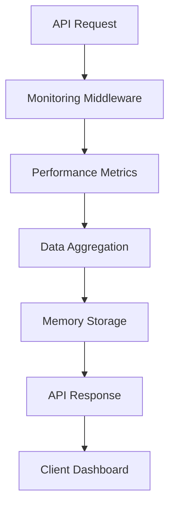
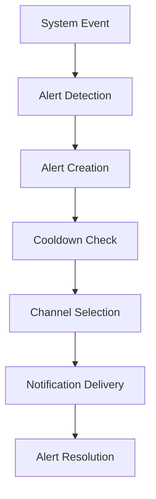
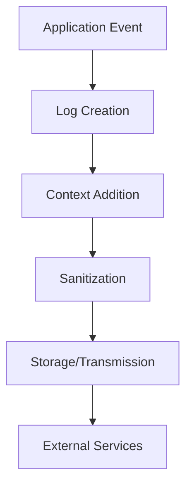

# Архитектура систем мониторинга

## Обзор

Система мониторинга Super Turbo состоит из нескольких взаимосвязанных компонентов, которые обеспечивают полную видимость состояния приложения, производительности и безопасности.

## Компоненты системы

### 1. Система метрик производительности

**Файл:** `src/lib/monitoring/performance-metrics.ts`

**Назначение:** Сбор и анализ метрик производительности API, компонентов и системы.

**Ключевые возможности:**

- Отслеживание времени ответа API
- Мониторинг рендеринга React компонентов
- Сбор системных метрик (память, CPU)
- Автоматическая агрегация и очистка данных

**Архитектура:**

```
┌─────────────────┐    ┌──────────────────┐    ┌─────────────────┐
│   API Routes    │───▶│ PerformanceMetrics│───▶│   Data Storage  │
└─────────────────┘    └──────────────────┘    └─────────────────┘
         │                       │                       │
         ▼                       ▼                       ▼
┌─────────────────┐    ┌──────────────────┐    ┌─────────────────┐
│  React Components│───▶│   Aggregation    │───▶│   Cleanup       │
└─────────────────┘    └──────────────────┘    └─────────────────┘
```

### 2. Система алертов

**Файл:** `src/lib/monitoring/alerting-system.ts`

**Назначение:** Создание, управление и отправка алертов о критических событиях.

**Ключевые возможности:**

- Множественные каналы уведомлений (Slack, Email, Webhook, Sentry)
- Правила эскалации и периоды кулдауна
- Классификация по типам и серьезности
- Автоматическое разрешение алертов

**Архитектура:**

```
┌─────────────────┐    ┌──────────────────┐    ┌─────────────────┐
│  Event Sources  │───▶│ AlertingSystem   │───▶│  Alert Channels │
└─────────────────┘    └──────────────────┘    └─────────────────┘
         │                       │                       │
         ▼                       ▼                       ▼
┌─────────────────┐    ┌──────────────────┐    ┌─────────────────┐
│  Health Monitor │    │  Escalation Rules│    │  Slack/Email    │
└─────────────────┘    └──────────────────┘    └─────────────────┘
```

### 3. Система логирования

**Файл:** `src/lib/monitoring/logging-system.ts`

**Назначение:** Структурированное логирование с контекстом и автоматической очисткой.

**Ключевые возможности:**

- Множественные уровни логирования
- Контекстная информация (userId, sessionId, requestId)
- Автоматическая очистка чувствительных данных
- Интеграция с Sentry для ошибок

**Архитектура:**

```
┌─────────────────┐    ┌──────────────────┐    ┌─────────────────┐
│  Application    │───▶│  LoggingSystem   │───▶│  Log Storage    │
└─────────────────┘    └──────────────────┘    └─────────────────┘
         │                       │                       │
         ▼                       ▼                       ▼
┌─────────────────┐    ┌──────────────────┐    ┌─────────────────┐
│  Context Data   │    │  Sanitization    │    │  Sentry         │
└─────────────────┘    └──────────────────┘    └─────────────────┘
```

### 4. Мониторинг здоровья

**Файл:** `src/lib/monitoring/health-monitor.ts`

**Назначение:** Проверка состояния различных компонентов системы.

**Ключевые возможности:**

- Автоматические проверки каждые 30 секунд
- Проверка базы данных, внешних API, памяти, диска
- Настраиваемые пороги для алертов
- Регистрация пользовательских проверок

**Архитектура:**

```
┌─────────────────┐    ┌──────────────────┐    ┌─────────────────┐
│  Health Checks  │───▶│  HealthMonitor   │───▶│  Status Report  │
└─────────────────┘    └──────────────────┘    └─────────────────┘
         │                       │                       │
         ▼                       ▼                       ▼
┌─────────────────┐    ┌──────────────────┐    ┌─────────────────┐
│  Database       │    │  Alert Thresholds│    │  API Response   │
│  External APIs  │    │  Status History  │    │  Dashboard      │
│  Memory/Disk    │    │  Custom Checks   │    │                 │
└─────────────────┘    └──────────────────┘    └─────────────────┘
```

### 5. Middleware мониторинга

**Файл:** `src/lib/monitoring/monitoring-middleware.ts`

**Назначение:** Автоматический мониторинг всех HTTP запросов.

**Ключевые возможности:**

- Отслеживание производительности запросов
- Обнаружение медленных запросов
- Мониторинг ошибок и их частоты
- Автоматическое создание алертов

**Архитектура:**

```
┌─────────────────┐    ┌──────────────────┐    ┌─────────────────┐
│  HTTP Request   │───▶│ MonitoringMiddleware│───▶│  Request Handler│
└─────────────────┘    └──────────────────┘    └─────────────────┘
         │                       │                       │
         ▼                       ▼                       ▼
┌─────────────────┐    ┌──────────────────┐    ┌─────────────────┐
│  Performance    │    │  Error Detection │    │  Response       │
│  Tracking       │    │  Rate Limiting   │    │  Headers        │
└─────────────────┘    └──────────────────┘    └─────────────────┘
```

## Потоки данных

### 1. Поток метрик производительности



### 2. Поток алертов



### 3. Поток логирования



## Конфигурация

### Переменные окружения

```bash
# Мониторинг
LOG_LEVEL=info
LOG_REMOTE_ENDPOINT=https://logs.example.com/api
LOG_REMOTE_TOKEN=your-log-token

# Алерты
ALERT_WEBHOOK_URL=https://hooks.slack.com/services/...
ALERT_WEBHOOK_TOKEN=your-webhook-token

# Sentry
SENTRY_DSN=your-sentry-dsn
SENTRY_ORG=your-org
SENTRY_PROJECT=your-project
```

### Конфигурация компонентов

```typescript
// Performance Metrics
const performanceConfig = {
  timeWindow: 60 * 60 * 1000, // 1 час
  maxRecords: 10000,
  cleanupInterval: 60 * 60 * 1000, // 1 час
};

// Alerting System
const alertConfig = {
  enabled: true,
  channels: [
    { type: "sentry", enabled: true },
    { type: "webhook", enabled: true },
  ],
  cooldownPeriods: {
    PERFORMANCE_DEGRADATION: 5 * 60 * 1000, // 5 минут
    HIGH_ERROR_RATE: 2 * 60 * 1000, // 2 минуты
  },
};

// Health Monitor
const healthConfig = {
  checkInterval: 30 * 1000, // 30 секунд
  timeout: 10 * 1000, // 10 секунд
  alertThresholds: {
    degraded: 2,
    unhealthy: 1,
  },
};
```

## Интеграции

### 1. Sentry

- Автоматическая отправка ошибок
- Performance monitoring
- Release tracking

### 2. Slack

- Уведомления об алертах
- Статус системы
- Отчеты о производительности

### 3. Prometheus

- Экспорт метрик в формате Prometheus
- Интеграция с Grafana
- Настраиваемые дашборды

### 4. Внешние системы

- Webhook уведомления
- API интеграции
- Кастомные каналы

## Масштабирование

### Горизонтальное масштабирование

- Использование Redis для хранения метрик
- Распределенное логирование
- Кластеризация алертов

### Вертикальное масштабирование

- Оптимизация памяти
- Кэширование данных
- Асинхронная обработка

## Безопасность

### Защита данных

- Шифрование чувствительных данных
- Очистка логов от секретов
- Контроль доступа к метрикам

### Аутентификация

- JWT токены для API
- Роли и права доступа
- Rate limiting

## Мониторинг мониторинга

### Самодиагностика

- Проверка состояния компонентов
- Мониторинг производительности
- Алерты о сбоях

### Метрики системы

- Время отклика
- Использование ресурсов
- Количество алертов

## Рекомендации по использованию

### 1. Настройка алертов

- Используйте разумные пороги
- Настройте эскалацию
- Регулярно проверяйте алерты

### 2. Оптимизация производительности

- Мониторьте ключевые метрики
- Настройте автоматическое масштабирование
- Используйте кэширование

### 3. Логирование

- Используйте структурированные логи
- Не логируйте чувствительные данные
- Настройте ротацию логов

### 4. Здоровье системы

- Регулярно проверяйте статус
- Настройте автоматические проверки
- Документируйте процедуры восстановления
