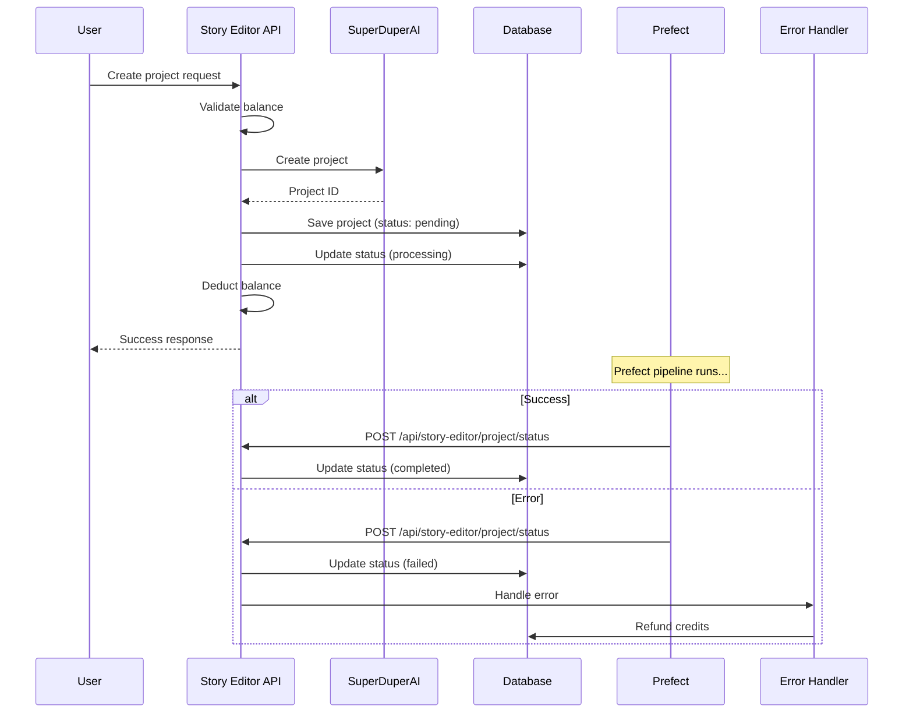

# Обработка ошибок проектов и откат транзакций

## Обзор

Система обработки ошибок проектов обеспечивает корректное управление жизненным циклом проектов, включая откат транзакций при ошибках Prefect пайплайнов.

## Проблема

Ранее при ошибках в Prefect пайплайнах:
- ✅ Проект создавался в SuperDuperAI API
- ✅ Проект сохранялся в локальную БД
- ✅ Баланс списывался
- ❌ **НО**: Prefect пайплайн падал с ошибкой
- ❌ **Результат**: Пользователь терял кредиты, проект оставался "мертвым"

## Решение

### 1. Статусы проектов

Проекты теперь имеют следующие статусы:

- `pending` - Проект создан, ожидает обработки
- `processing` - Prefect пайплайн запущен
- `completed` - Проект успешно завершен
- `failed` - Проект завершился с ошибкой

### 2. Новая схема базы данных

```sql
ALTER TABLE "UserProject" 
ADD COLUMN "status" varchar(20) NOT NULL DEFAULT 'pending',
ADD COLUMN "creditsUsed" integer DEFAULT 0,
ADD COLUMN "errorMessage" text,
ADD COLUMN "updatedAt" timestamp NOT NULL DEFAULT now();
```

### 3. Обновленный процесс создания проекта



### 4. Механизм отката

При ошибках система автоматически:

1. **Обновляет статус проекта** на `failed`
2. **Возвращает кредиты** пользователю
3. **Логирует ошибку** для мониторинга
4. **Сохраняет сообщение об ошибке** в БД

### 5. API Endpoints

#### Создание проекта
```
POST /api/story-editor/generate
```

#### Обновление статуса (для Prefect)
```
POST /api/story-editor/project/status
{
  "projectId": "uuid",
  "status": "completed" | "failed",
  "errorMessage": "optional error message"
}
```

#### Получение статуса проекта
```
GET /api/story-editor/project/status?projectId=uuid
```

#### История проектов пользователя
```
GET /api/user/projects?status=completed&includeStats=true
```

## Файлы

### Основные компоненты

- `src/lib/db/schema.ts` - Обновленная схема БД
- `src/lib/db/project-queries.ts` - Функции для работы с проектами
- `src/lib/utils/project-error-handler.ts` - Обработка ошибок и откат
- `src/app/api/story-editor/generate/route.ts` - Обновленный API создания проекта
- `src/app/api/story-editor/project/status/route.ts` - API обновления статуса
- `src/app/api/user/projects/route.ts` - API истории проектов

### Миграции

- `src/lib/db/migrations/0011_add_project_status.sql` - Добавление полей статуса

## Интеграция с Prefect

Prefect пайплайны должны вызывать API обновления статуса:

```python
# При успешном завершении
requests.post(f"{API_BASE}/api/story-editor/project/status", json={
    "projectId": project_id,
    "status": "completed"
})

# При ошибке
requests.post(f"{API_BASE}/api/story-editor/project/status", json={
    "projectId": project_id,
    "status": "failed",
    "errorMessage": str(error)
})
```

## Мониторинг

Система логирует все ключевые события:

- `💾 Project created` - Проект создан
- `📊 Project status updated` - Статус обновлен
- `💰 Refunded credits` - Кредиты возвращены
- `🚨 Project error` - Ошибка проекта
- `🔄 Rolling back project` - Откат проекта

## Преимущества

1. **Надежность** - Пользователи не теряют кредиты при ошибках
2. **Прозрачность** - Четкий статус каждого проекта
3. **Мониторинг** - Полное логирование всех операций
4. **Восстановление** - Автоматический откат при ошибках
5. **Аудит** - История всех операций с проектами


