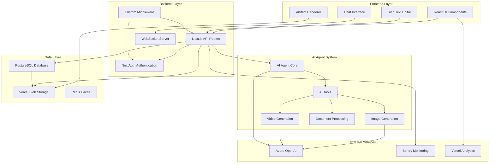
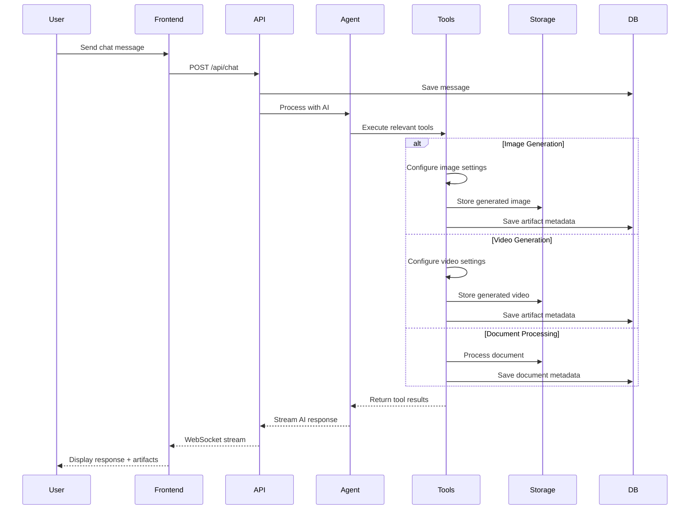

# Super Chatbot Architecture

## Overview

Super Chatbot is a comprehensive AI-powered chat application built with Next.js 15, featuring advanced capabilities including text generation, image generation, video generation, document processing, and real-time WebSocket communication. The application uses modern React patterns, server-side rendering, and a robust backend infrastructure.

## System Architecture Diagram



## Message Flow Sequence



## Architecture Components

### 1. Frontend Layer

#### Technology Stack
- **Framework**: Next.js 15 (App Router) with React 19
- **UI Components**: Radix UI primitives with Tailwind CSS
- **State Management**: React Server Components + SWR for client state
- **Styling**: Tailwind CSS with custom design system
- **Animations**: Framer Motion
- **Icons**: Lucide React + Radix Icons
- **Typography**: Geist font family

#### Key Frontend Features
- Server-Side Rendering (SSR) with Partial Pre-Rendering (PPR)
- Progressive Web App capabilities
- Real-time chat interface
- Artifact rendering (code, images, videos, documents)
- Responsive design with mobile support
- Dark/Light theme switching
- Rich text editor with ProseMirror
- Code editor with CodeMirror

### 2. Backend Layer

#### API Architecture
- **Framework**: Next.js API Routes (App Router)
- **Runtime**: Node.js with Vercel Functions
- **Authentication**: NextAuth v5 with custom providers
- **Middleware**: Custom authentication and routing middleware

#### Core API Endpoints
```
/api/auth/          - Authentication routes
/api/chat/          - Chat message handling
/api/document/      - Document processing
/api/files/upload/  - File upload handling
/api/history/       - Chat history management
/api/message-count/ - Usage tracking
/api/save-message/  - Message persistence
/api/suggestions/   - AI-powered suggestions
/api/vote/          - Message rating system
```

### 3. AI Agent System

#### AI Framework
- **Core**: Vercel AI SDK v4.3.13
- **Models**: Azure OpenAI integration
- **Tools**: Custom tool system with 8+ specialized tools

#### Available AI Tools
1. **create-document**: Document creation and editing
2. **update-document**: Document modification
3. **configure-image-generation**: Image generation configuration
4. **configure-video-generation**: Video generation configuration
5. **get-weather**: Weather information retrieval
6. **request-suggestions**: Intelligent suggestions
7. **diagnose-styles**: Style analysis and recommendations

#### Image Generation
- **Models**: FLUX Pro, FLUX Dev
- **Resolutions**: Multiple aspect ratios (16:9, 4:3, 1:1, 4:5, 9:16)
- **Styles**: 50+ predefined styles with custom style support
- **Features**: 
  - Shot size control (8 different shot types)
  - Negative prompts
  - Seed support for reproducibility
  - Quality settings (HD, Full HD)

#### Video Generation
- **Models**: SuperDuperAi api (Veo3)
- **Formats**: Multiple resolutions and frame rates
- **Features**:
  - Frame rate control (24, 30, 60, 120 FPS)
  - Duration control
  - Shot size configuration
  - Style application
  - Progress tracking

### 4. Database Layer

#### Technology
- **ORM**: Drizzle ORM v0.34.0
- **Database**: PostgreSQL (Vercel Postgres)
- **Migrations**: Automated with Drizzle Kit
- **Connection**: Connection pooling with postgres driver

#### Schema Structure
- User management and authentication
- Chat sessions and messages
- Document artifacts
- Media generation history
- Usage tracking and analytics
- File storage metadata

### 5. File Storage

#### Storage Backend
- **Primary**: Vercel Blob Storage
- **Features**: 
  - Automatic file optimization
  - CDN distribution
  - Secure upload handling
  - Multiple file format support

#### Supported File Types
- Images (PNG, JPEG, WebP)
- Videos (MP4, WebM)
- Documents (PDF, TXT, CSV)
- Code files
- Spreadsheets

### 6. Real-time Communication

#### WebSocket Implementation
- Custom WebSocket server for real-time features
- Message streaming for AI responses
- Live collaboration support
- Connection state management
- Automatic reconnection handling

### 7. Authentication & Authorization

#### Authentication System
- **Provider**: NextAuth v5
- **Strategies**: 
  - Guest authentication for anonymous users
  - OAuth providers support
  - Session-based authentication
- **Security**: 
  - JWT tokens with secure cookies
  - CSRF protection
  - Rate limiting
  - Secure password hashing with bcrypt-ts

#### User Management
- Guest user system with automatic cleanup
- Role-based access control
- Usage tracking and limits
- Session management

### 8. Development & Deployment

#### Development Tools
- **Linting**: ESLint + Biome
- **Testing**: Playwright for E2E testing
- **Type Safety**: TypeScript with strict mode
- **Package Manager**: pnpm
- **Build System**: Next.js with Turbopack

#### Deployment
- **Platform**: Vercel
- **Features**:
  - Automatic deployments
  - Preview deployments
  - Edge functions
  - Analytics integration

### 9. Monitoring & Observability

#### Error Tracking
- **Service**: Sentry
- **Features**:
  - Error monitoring
  - Performance tracking
  - User session recording
  - Custom breadcrumbs
  - Source map support

#### Analytics
- **Service**: Vercel Analytics
- **Metrics**: 
  - Page views
  - User interactions
  - Performance metrics
  - Custom events

### 10. Security

#### Security Measures
- HTTPS enforcement
- Content Security Policy (CSP)
- CORS configuration
- Input validation with Zod
- SQL injection prevention
- XSS protection
- Rate limiting

## Data Flow

### Chat Message Flow
1. User sends message through chat interface
2. Message validated and saved to database
3. AI agent processes message with available tools
4. Response streamed back via WebSocket
5. Artifacts generated and stored in blob storage
6. Final response saved to database

### Media Generation Flow
1. User requests image/video generation
2. Configuration tool validates parameters
3. Generation request sent to external API
4. Progress tracked and streamed to client
5. Generated media stored in blob storage
6. Artifact created and linked to chat session

### Document Processing Flow
1. File uploaded through drag-and-drop interface
2. File validated and stored in blob storage
3. Content extracted and processed
4. Document artifact created
5. Content made available for AI processing

## Performance Optimizations

### Frontend Optimizations
- Server Components for reduced JavaScript bundle
- Streaming responses for perceived performance
- Image optimization with Next.js Image component
- Code splitting and lazy loading
- Prefetching for critical routes

### Backend Optimizations
- Database connection pooling
- Query optimization with Drizzle ORM
- Caching strategies for static content
- Streaming responses for large payloads
- Efficient file upload handling

### Infrastructure Optimizations
- CDN for static assets
- Edge functions for low latency
- Automatic scaling with Vercel
- Database read replicas
- Optimized Docker builds

## Scalability Considerations

### Horizontal Scaling
- Stateless application design
- Database connection pooling
- External storage for files
- Queue system for background jobs
- Load balancing capabilities

### Vertical Scaling
- Memory optimization
- Database query optimization
- Efficient streaming protocols
- Resource monitoring
- Auto-scaling configuration

## Security Best Practices

### Application Security
- Input sanitization and validation
- SQL injection prevention
- XSS protection
- CSRF tokens
- Secure authentication flows

### Infrastructure Security
- HTTPS enforcement
- Environment variable protection
- Secrets management
- Access control lists
- Regular security updates

## Future Enhancements

### Planned Features
- Multi-modal AI interactions
- Advanced collaboration tools
- Plugin system for custom tools
- Mobile application
- API for third-party integrations

### Performance Improvements
- Edge caching strategies
- Advanced streaming protocols
- Offline capability
- Progressive loading
- Resource optimization

## Dependencies Summary

### Core Framework
- Next.js 15.3.0 with App Router
- React 19 RC
- TypeScript 5.6.3

### AI & ML
- Vercel AI SDK 4.3.13
- Azure OpenAI integration
- Custom tool framework

### Database & Storage
- Drizzle ORM 0.34.0
- PostgreSQL with Vercel Postgres
- Vercel Blob for file storage

### UI & Styling
- Tailwind CSS 3.4.1
- Radix UI components
- Framer Motion animations
- Geist font family

### Development Tools
- Biome for linting and formatting
- Playwright for testing
- Sentry for monitoring
- pnpm for package management 