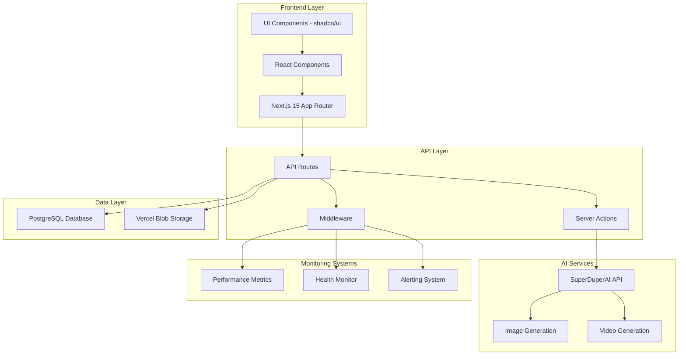

# Обзор архитектуры системы Super Turbo

## Диаграмма архитектуры

## Компоненты системы

### Frontend Layer

- **Next.js 15 App Router**: Современная маршрутизация
- **React Components**: Переиспользуемые UI компоненты
- **shadcn/ui**: Дизайн-система

### API Layer

- **API Routes**: RESTful endpoints
- **Server Actions**: Серверные действия
- **Middleware**: Обработка запросов

### AI Services

- **SuperDuperAI API**: Основной провайдер AI
- **Image Generation**: FLUX модели
- **Video Generation**: Veo3

### Monitoring Systems

- **Performance Metrics**: Сбор метрик
- **Health Monitor**: Мониторинг состояния
- **Alerting System**: Уведомления

### Data Layer

- **PostgreSQL**: Основная БД
- **Vercel Blob**: Медиафайлы
