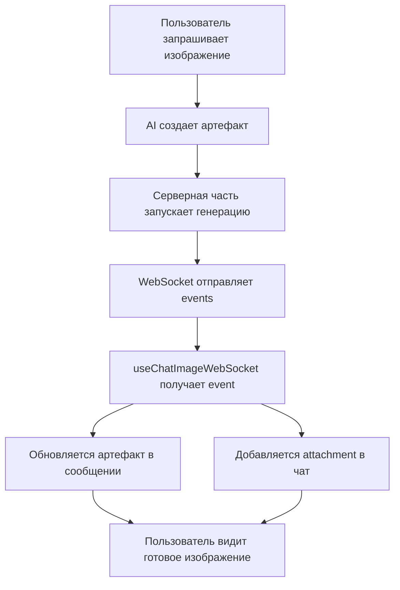

# Архитектура WebSocket соединений на уровне чата

## Обзор изменений

Система была реорганизована для работы по принципу ChatGPT - одно глобальное WebSocket соединение на уровне чата, которое автоматически обновляет сообщения при генерации изображений.

## Преимущества новой архитектуры

### ✅ **Проблемы, которые решены:**

1. **Потеря изображений при создании новых артефактов** - теперь WebSocket работает глобально
2. **Множественные соединения** - одно соединение на чат вместо соединения на артефакт
3. **Сложность управления состоянием** - централизованное управление через чат
4. **Дублирование обновлений** - четкое разделение ответственности

### 🎯 **Как работает новая система:**

1. **Один WebSocket на чат** - соединение инициализируется при загрузке чата
2. **Автоматическое обновление сообщений** - изображения добавляются в чат автоматически
3. **Обновление артефактов** - существующие артефакты обновляются с готовыми изображениями
4. **Умная очистка** - соединения очищаются при переключении между чатами

## Архитектура компонентов

### 1. Основной чат (`components/chat.tsx`)

```typescript
// Глобальное WebSocket соединение для изображений
useChatImageWebSocket({
  chatId: id,
  messages,
  setMessages,
  enabled: !isReadonly,
});
```

**Ответственность:**

- Инициализация WebSocket соединения для чата
- Управление сообщениями чата
- Автоматическое добавление изображений в чат

### 2. WebSocket хук (`hooks/use-chat-image-websocket.ts`)

```typescript
export const useChatImageWebSocket = ({
  chatId,
  messages,
  setMessages,
  enabled = true,
}: ChatImageWebSocketOptions) => {
  // Обработка событий WebSocket
  // Обновление сообщений и артефактов
};
```

**Ответственность:**

- Подключение к WebSocket для конкретного чата
- Обработка событий генерации изображений
- Обновление сообщений при получении изображений
- Обновление содержимого существующих артефактов

### 3. ImageEditor (`components/image-editor.tsx`)

```typescript
// Отключен WebSocket - только UI и генерация
const imageGeneration = useImageGeneration(undefined);
```

**Ответственность:**

- Отображение интерфейса генерации
- Запуск процесса генерации изображений
- Локальное состояние UI (без WebSocket)

### 4. Утилита очистки (`lib/utils/chat-websocket-cleanup.ts`)

```typescript
export class ChatWebSocketCleanup {
  static setActiveChat(chatId: string); // Переключение между чатами
  static cleanupAll(); // Полная очистка
  static getDebugInfo(); // Отладочная информация
}
```

**Ответственность:**

- Очистка соединений при переключении чатов
- Предотвращение накопления обработчиков
- Отладка и мониторинг соединений

## Поток данных



## Обработка событий WebSocket

### 1. Подписка на проект

```typescript
case 'subscribe':
  console.log('✅ Subscribed to project', eventData.projectId);
  break;
```

### 2. Получение изображения

```typescript
case 'file':
  if (eventData.object?.type === 'image' && eventData.object?.url) {
    // Найти и обновить артефакт
    // Или добавить новое сообщение с attachment
  }
  break;
```

### 3. Обработка ошибок

```typescript
case 'error':
  // Обработка ошибок генерации
  break;
```

## Управление состоянием

### Артефакты

- **Начальное состояние**: `status: 'pending'`
- **Во время генерации**: `status: 'processing'`
- **После завершения**: `status: 'completed'`, `imageUrl: 'https://...'`

### Сообщения чата

- **Артефакт создается** с `status: 'pending'`
- **WebSocket обновляет** содержимое артефакта
- **Опционально добавляется** новое сообщение с attachment

## Отладка и мониторинг

### Консольные команды

```javascript
// Информация о текущих соединениях
chatWebSocketCleanup.getDebugInfo();

// Принудительная очистка
chatWebSocketCleanup.cleanupAll();

// Системная информация
imageSystem.health();
```

### Логирование

- `💬 Chat WebSocket:` - события глобального WebSocket
- `🎨 ImageEditor:` - события компонента редактора
- `🧹 ChatWebSocketCleanup:` - события очистки соединений

## Миграция с предыдущей версии

### Что изменилось:

1. **WebSocket перенесен на уровень чата** - больше не в артефактах
2. **useImageGeneration** может работать без WebSocket
3. **Автоматическое добавление изображений** в чат
4. **Централизованная очистка** соединений

### Совместимость:

- **Существующие артефакты** продолжают работать
- **Legacy форматы изображений** поддерживаются
- **API генерации** не изменился

## Конфигурация

### Переменные окружения

```env
NEXT_PUBLIC_WS_URL=https://editor.superduperai.co
```

### Настройки WebSocket

- **Автоматическое переподключение**: до 5 попыток
- **Экспоненциальная задержка**: 2s, 4s, 8s, 16s, 32s
- **Очистка при неактивности**: через 1 секунду после удаления последнего обработчика

## Рекомендации по использованию

### Для разработчиков:

1. **Используйте `useChatImageWebSocket`** только на уровне чата
2. **Отключите WebSocket** в компонентах артефактов
3. **Следите за логами** для отладки соединений
4. **Используйте утилиты очистки** при смене контекста

### Для тестирования:

1. **Проверьте создание нескольких изображений** в одном чате
2. **Переключитесь между чатами** и проверьте очистку
3. **Создайте новый артефакт** пока старый еще генерируется
4. **Проверьте работу** в режиме только для чтения

## Планы на будущее

1. **Поддержка других типов медиа** (видео, аудио)
2. **Улучшенная обработка ошибок** с retry логикой
3. **Кэширование состояния** для быстрого восстановления
4. **Метрики производительности** WebSocket соединений
