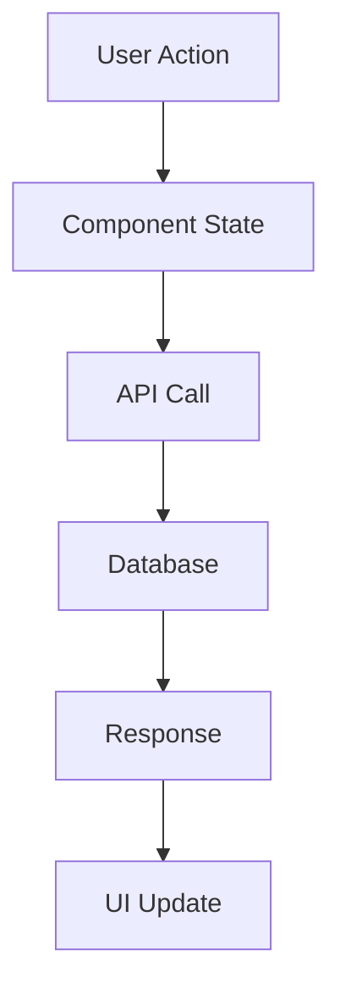

# Implementation Plan Template

Use this template when creating implementation plans for new features or significant changes.

---

# Implementation Plan: [Feature Name]

**Date**: [YYYY-MM-DD]  
**AI Agent**: [Agent Identifier]  
**Reviewer**: [Human Reviewer Name]  
**Status**: [Draft/Under Review/Approved/In Progress/Completed]

## Overview

Brief description of the feature and its purpose. Include:
- What problem does this solve?
- Who are the users?
- How does it fit into the overall product?

## Requirements

### Functional Requirements
- [ ] Requirement 1
- [ ] Requirement 2
- [ ] Requirement 3

### Non-Functional Requirements
- [ ] Performance targets
- [ ] Security considerations
- [ ] Accessibility requirements
- [ ] Browser/device compatibility

## Architecture Decisions

### Component Structure
```
/components/
  /new-feature/
    - Component1.tsx
    - Component2.tsx
    - types.ts
    - utils.ts
```

### Data Flow


### State Management
- Local component state using useState/useReducer
- Global state using Zustand/Context
- Server state using React Query/SWR
- Form state using React Hook Form

### Database Schema Changes
```sql
-- New tables or modifications
CREATE TABLE IF NOT EXISTS new_feature_data (
  id SERIAL PRIMARY KEY,
  user_id UUID REFERENCES users(id),
  data JSONB NOT NULL,
  created_at TIMESTAMP WITH TIME ZONE DEFAULT NOW()
);
```

## SuperDuperAI Integration

### APIs to be Used
- [ ] Image Generation (`/api/v1/generation/image`)
- [ ] Video Generation (`/api/v1/generation/video`)
- [ ] File Management (`/api/v1/files`)
- [ ] WebSocket (`wss://dev-editor.superduperai.co/ws`)

### Authentication Strategy
- Bearer token authentication
- Token refresh handling
- Error handling for auth failures

### Error Handling
- Rate limiting (429 errors)
- Authentication errors (401)
- Validation errors (422)
- Server errors (500)

### Real-time Updates
- WebSocket connection management
- Message type handling
- Progress updates
- Connection retry logic

## API Design

### New Endpoints

#### POST /api/new-feature
```typescript
interface CreateFeatureRequest {
  name: string
  description: string
  settings: FeatureSettings
}

interface CreateFeatureResponse {
  id: string
  status: 'created' | 'error'
  data?: FeatureData
  error?: string
}
```

#### GET /api/new-feature/[id]
```typescript
interface GetFeatureResponse {
  id: string
  data: FeatureData
  createdAt: string
  updatedAt: string
}
```

### Existing Endpoint Modifications
- None / List any modifications needed

## Dependencies

### New Packages
```json
{
  "new-package": "^1.0.0",
  "another-package": "^2.1.0"
}
```

### Potential Conflicts
- Check compatibility with existing packages
- Version conflicts to resolve
- Breaking changes in dependencies

## Implementation Steps

### Phase 1: Foundation
1. [ ] Set up basic component structure
2. [ ] Create TypeScript interfaces
3. [ ] Implement database migrations
4. [ ] Add basic API endpoints

### Phase 2: Core Functionality
1. [ ] Implement main feature logic
2. [ ] Add SuperDuperAI integration
3. [ ] Implement real-time updates
4. [ ] Add error handling

### Phase 3: UI/UX
1. [ ] Create user interface
2. [ ] Add loading states
3. [ ] Implement error boundaries
4. [ ] Add accessibility features

### Phase 4: Testing & Polish
1. [ ] Write unit tests
2. [ ] Add integration tests
3. [ ] Implement E2E tests
4. [ ] Performance optimization

## Testing Strategy

### Unit Tests
```typescript
// Test files to create
- components/new-feature/Component1.test.tsx
- lib/new-feature/utils.test.ts
- app/api/new-feature/route.test.ts
```

### Integration Tests
- API endpoint integration
- Database operations
- SuperDuperAI API integration
- WebSocket functionality

### E2E Tests
```typescript
// Playwright test scenarios
test('user can create new feature', async ({ page }) => {
  // Test implementation
})

test('feature works with SuperDuperAI generation', async ({ page }) => {
  // Test implementation
})
```

### Manual Testing Checklist
- [ ] Create new feature item
- [ ] Edit existing feature
- [ ] Delete feature
- [ ] Error handling scenarios
- [ ] Real-time updates
- [ ] Mobile responsiveness

## Security Considerations

### Input Validation
- Zod schemas for all inputs
- Rate limiting on API endpoints
- CSRF protection
- XSS prevention

### Data Protection
- User data encryption
- Secure API communication
- Access control validation
- Audit logging

## Performance Considerations

### Client-Side
- Component lazy loading
- Image optimization
- Bundle size optimization
- Caching strategies

### Server-Side
- Database query optimization
- API response caching
- Connection pooling
- Memory usage monitoring

## Deployment Considerations

### Environment Variables
```bash
# New environment variables needed
NEW_FEATURE_API_KEY=your_key_here
NEW_FEATURE_CONFIG_URL=https://config.example.com
```

### Database Migrations
```bash
# Migration commands
pnpm db:migrate
pnpm db:seed # if needed
```

### Configuration Updates
- Next.js config changes
- Vercel settings
- CDN configuration
- Monitoring setup

## Risk Assessment

### High Risks
- **Risk**: SuperDuperAI API rate limiting
  - **Mitigation**: Implement proper retry logic and user feedback
  - **Rollback**: Disable feature if API unavailable

### Medium Risks
- **Risk**: Database performance impact
  - **Mitigation**: Proper indexing and query optimization
  - **Rollback**: Database migration rollback scripts

### Low Risks
- **Risk**: UI performance on mobile
  - **Mitigation**: Progressive enhancement and testing
  - **Rollback**: CSS-only fallbacks

## Success Metrics

### Primary Metrics
- Feature adoption rate
- User engagement time
- Error rate < 1%
- API response time < 500ms

### Secondary Metrics
- User satisfaction scores
- Support ticket volume
- Performance impact
- Development velocity

## Rollback Plan

### Immediate Rollback (< 1 hour)
1. Feature flag disable
2. Route deactivation
3. API endpoint disabling

### Full Rollback (< 24 hours)
1. Database migration rollback
2. Code revert
3. CDN cache invalidation
4. Configuration reset

## Post-Implementation

### Monitoring
- Error tracking with Sentry
- Performance monitoring
- User analytics
- API usage metrics

### Documentation Updates
- [ ] Update user documentation
- [ ] Update developer documentation
- [ ] Update API documentation
- [ ] Record architecture decisions

### Future Improvements
- Enhancement opportunities
- Performance optimizations
- Feature extensions
- Technical debt items

---

## Approval

**Implementation Plan Reviewed By**: [Name]  
**Date**: [YYYY-MM-DD]  
**Status**: [Approved/Needs Changes]  
**Comments**: [Review comments]  

**Ready for Implementation**: [Yes/No]  
**Estimated Timeline**: [X days/weeks]  
**Assigned AI Agent**: [Agent Identifier] 