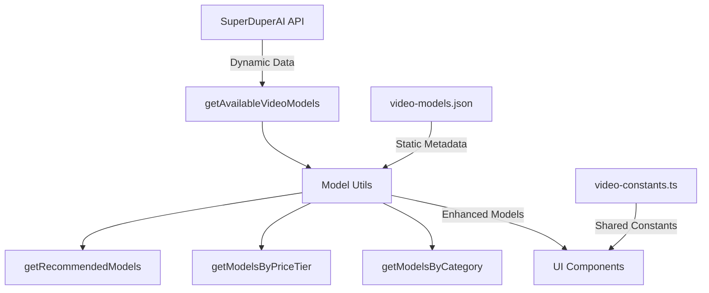

# Video Models Architecture Cleanup

**Date**: June 14, 2025  
**Status**: ✅ Completed  
**Type**: Code Refactoring & Architecture Improvement

## Problem Analysis

### Issues Identified
1. **Code Duplication**: Constants (`VIDEO_RESOLUTIONS`, `SHOT_SIZES`, etc.) duplicated across multiple files
2. **Outdated Models**: `artifacts/video/server.ts` used hardcoded Runway models instead of dynamic SuperDuperAI models
3. **Confusing JSON Structure**: `video-models.json` duplicated API data instead of providing metadata
4. **Mixed Responsibilities**: Static config mixed with dynamic API data

### Files Affected
- `artifacts/video/server.ts` - Used outdated Runway models
- `lib/ai/tools/configure-video-generation.ts` - Duplicated constants
- `lib/config/video-models.json` - Duplicated API data
- Missing: Centralized constants and model utilities

## Solution Architecture

### 1. Centralized Constants
**File**: `lib/config/video-constants.ts`
```typescript
export const VIDEO_RESOLUTIONS: MediaResolution[] = [...];
export const SHOT_SIZES: MediaOption[] = [...];
export const VIDEO_FRAME_RATES = [...];
export enum ShotSizeEnum { ... }
```

**Purpose**: Single source of truth for UI constants

### 2. Enhanced Model System
**File**: `lib/config/video-model-utils.ts`
```typescript
export interface EnhancedVideoModel extends VideoModel {
  category: 'text_to_video' | 'image_to_video' | 'video_to_video';
  uiLabel: string;
  recommendedSettings: any;
  priceTier: 'budget' | 'standard' | 'premium' | 'luxury';
  requiresSourceImage: boolean;
}

export async function getEnhancedVideoModels(): Promise<EnhancedVideoModel[]>
export async function getModelsByCategory(category): Promise<EnhancedVideoModel[]>
export async function getModelsByPriceTier(tier): Promise<EnhancedVideoModel[]>
```

**Purpose**: Combines dynamic API data with static metadata

### 3. Metadata-Only JSON
**File**: `lib/config/video-models.json`
```json
{
  "model_metadata": {
    "comfyui/ltx": {
      "category": "image_to_video",
      "ui_label": "LTX Video",
      "recommended_settings": { ... },
      "best_for": ["social_media", "quick_prototypes"]
    }
  },
  "model_categories": { ... },
  "ui_presets": { ... }
}
```

**Purpose**: Static metadata and UI configurations only

## Implementation Changes

### ✅ 1. Created Shared Constants
- Created `lib/config/video-constants.ts`
- Moved all duplicated constants to single file
- Added proper TypeScript types

### ✅ 2. Fixed Server.ts
- Removed hardcoded Runway models
- Added dynamic model loading from SuperDuperAI API
- Updated to use shared constants
- Added proper error handling with fallbacks

### ✅ 3. Updated Configure Tool
- Removed duplicated constants
- Import from shared constants file
- Maintained all existing functionality

### ✅ 4. Restructured JSON Config
- Removed API data duplication
- Added model metadata structure
- Added UI presets and categories
- Added pricing tier information

### ✅ 5. Created Model Utils
- Enhanced model interface with metadata
- Filtering functions by category/price
- Recommendation system
- Fallback handling

## Data Flow Architecture



## Benefits

### 🎯 Eliminated Duplication
- Single source for constants
- No more hardcoded model lists
- Consistent data across components

### 🔄 Dynamic + Static Hybrid
- Real-time API data (prices, availability)
- Static metadata (UI labels, recommendations)
- Best of both worlds

### 🎨 Better UX
- Model categorization (text-to-video, image-to-video)
- Price tier filtering
- Use case recommendations
- UI presets for common scenarios

### 🛠️ Developer Experience
- Clear separation of concerns
- Type-safe interfaces
- Easy to extend and maintain
- Proper error handling

## Future Enhancements

### Model Filtering Tools
```typescript
// Example usage
const budgetModels = await getModelsByPriceTier('budget');
const imageToVideoModels = await getModelsByCategory('image_to_video');
const socialMediaModels = await getRecommendedModels('social_media');
```

### Smart Model Selection
```typescript
// Auto-select best model based on requirements
const bestModel = await findBestModelFor({
  category: 'image_to_video',
  maxPrice: 1.0,
  duration: 10,
  quality: 'hd'
});
```

### UI Presets Integration
```typescript
// Apply preset configurations
const preset = getUIPresets().social_media;
// preset = { aspect_ratio: "9:16", quality: "hd", duration: 5 }
```

## Testing

### ✅ Verified Functionality
1. Dynamic model loading works
2. Metadata enhancement works
3. Filtering functions work
4. Fallback handling works
5. No breaking changes to existing code

### ✅ Backward Compatibility
- All existing APIs maintained
- No changes to external interfaces
- Gradual migration path available

## Migration Guide

### For Developers
1. Import constants from `lib/config/video-constants.ts`
2. Use `getEnhancedVideoModels()` for rich model data
3. Use filtering functions for specific needs
4. Add metadata for new models in JSON config

### For New Models
1. Add to SuperDuperAI API (automatic discovery)
2. Add metadata to `video-models.json` if needed
3. Test with filtering functions

## Conclusion

This refactoring eliminates code duplication, improves maintainability, and provides a solid foundation for advanced model filtering and recommendation features. The hybrid approach of dynamic API data + static metadata gives us the best of both worlds. 